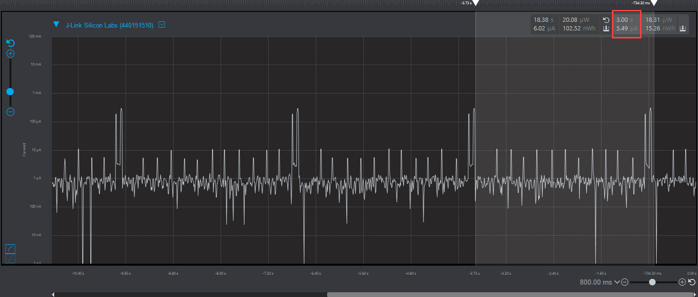
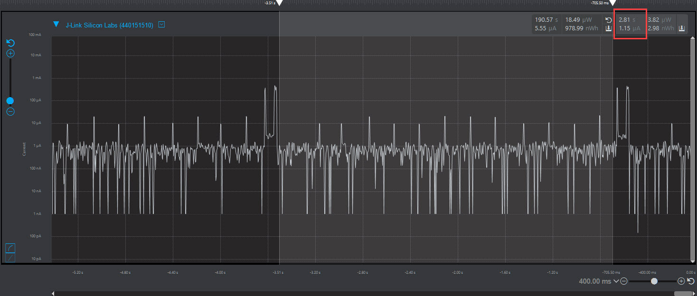
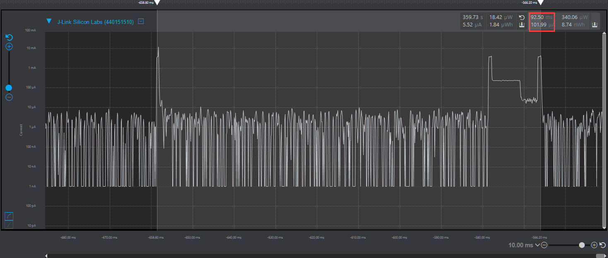

Please include your answers to the questions below with your submission, entering into the space below each question
See [Mastering Markdown](https://guides.github.com/features/mastering-markdown/) for github markdown formatting if desired.

*Be sure to take measurements in the "Default" configuration of the profiler to ensure your logging logic is not impacting current/time measurements.*

*Please include screenshots of the profiler window detailing each current measurement captured.  See [Shared document](https://docs.google.com/document/d/1Ro9G2Nsr_ZXDhBYJ6YyF9CPivb--6UjhHRmVhDGySag/edit?usp=sharing) for instructions.* 

1. What is the average current per period?
   Answer: 5.49uA
    Screenshot:  
     

2. What is the average current when the Si7021 is Load Power Management OFF?
   Answer:
    Screenshot: 1.15uA
     

3. What is the average current when the Si7021 is Load Power Management ON?
   Answer: 101.99uA
    Screenshot:  
     

4. How long is the Si7021 Load Power Management ON for 1 temperature reading?
   Answer: 92.50ms ~= (80ms power up delay + 11ms conversion delay)
    Screenshot:  
     

5. What is the total operating time of your design for assignment 4 in hours assuming a 1000mAh supply?
182,149.4 hours

6. How has the power consumption performance of your design changed since the previous assignment?
This method is 20X more efficient.  The Power Management ON power consumption is nearly 40X more efficient.

7. Describe how you have tested your code to ensure you are sleeping in EM1 mode during I2C transfers.
The SLEEP_sleep() function returns the Energy Mode that was entered.  Using the logging function, I printed this out next to the current state machine state to see what sleep mode was entered in each state.